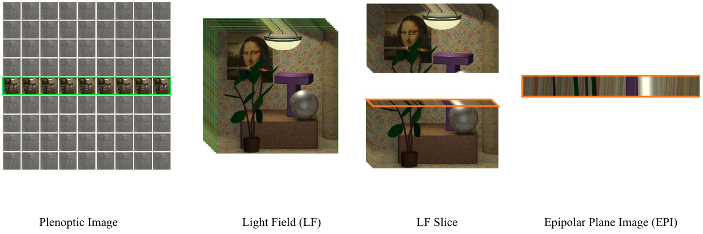
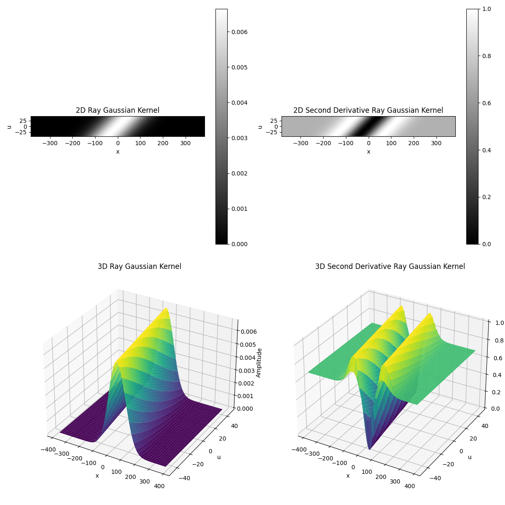
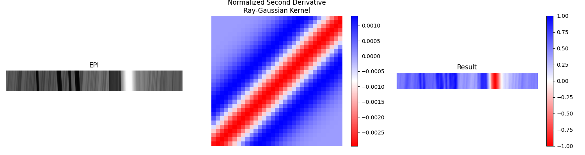
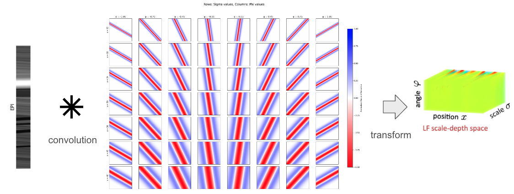

# Light Field Scale-Depth Space Transform for Dense Depth Estimation (Unofficial)

This repository is for learning purpose only and does not present the paper itself. I create this repo to have more understanding about the data format and mathematic formular of the paper.

I use Python 3.8 with OpenCV and Matplotlib to visualize the input and output data at each steps. There are three important key concepts that I want to visualize by code, then compare my result with the paper result.

### Download dataset

I find the old HCI dataset from this [repository](https://github.com/hasanlatif/HCI-Dataset-old-).

### Light Field and EPI



The paper have very poor self-explanation image about the Light Field and EPI. I want to visualize the Light Field and EPI by using the data from the paper. You can run as follow to reproduce the result:

```bash
python lf_epi.py
```

### Ray Gaussian Kernel



For the new concept 'Ray Gaussian Kernel', the paper fail to visualize the kernel and its normalized second derivative. You can run as follow to reproduce the result:

```bash
python all_ray_gaussian_kernal.py
```

### Convolution result



The paper does not show the convolution result of the Ray Gaussian Kernel and the EPI to see how the ray is detected. You can run as follow to reproduce the result:

```bash
python convolution_result.py
```

### Lisad Space



For lisad space, I still struggle with the concept and how author choose parameters for creating the space. However, you can try to create a grid of normalize second derivative ray gaussian kernel and visualize it by running the following command:

```bash
python grid_kernels.py
```

### TODO

This repository is still in progress. I will update the code and the README file soon. You can contribute to this repository by creating a pull request.

* [x] Light Field and EPI
* [x] Ray Gaussian Kernel
* [x] Normalized Second Derivative Ray Gaussian Kernel
* [x] Convolution result
* [ ] Lisad Space
* [ ] Depth Estimation
* [ ] Occlusion Handling
* [ ] Weak Ray Removal
